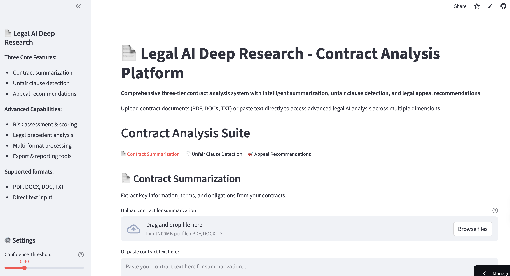

# 📄 Contract Analysis System - Unfair Clause Detection

An advanced contract analysis system that uses **LexGLUE methodology** and state-of-the-art NLP models to detect potentially unfair clauses in contracts.

## 📸 App Preview

*🚀 Live demo: [Contract Analysis App](https://legalaideepresearch-rzy5kk9k2ygxudlavpsg4z.streamlit.app)*

## 🎯 **Primary Features**

### 1. Contract Summarization 📝
- **Intelligent Summarization**: Extract key contract details and terms
- **Key Information Extraction**: Identify parties, dates, obligations, and critical clauses
- **Structured Output**: Organized summary with clear sections
- **Multi-format Support**: PDF, DOCX, DOC, and TXT file processing

### 2. Unfair Clause Detection ⚖️
- **Pattern-based Detection**: Rule-based identification of known unfair clause patterns
- **ML-based Detection**: Pre-trained LexGLUE models (marmolpen3/lexglue-unfair-tos) for intelligent clause classification  
- **LexGLUE Integration**: Uses UNFAIR-ToS models specifically trained for legal text
- **Risk Assessment**: Categorizes clauses by unfairness severity with confidence scoring

### 3. Appeal Recommendations 🎯
- **FAISS-powered Search**: Vector similarity search for legal precedents
- **Contextual Recommendations**: Tailored appeal strategies based on contract content
- **Risk-based Prioritization**: Focus on high-risk clauses with actionable advice
- **Legal Precedent Analysis**: Reference similar cases and outcomes

### Advanced Features
- **Comprehensive Analysis**: All three features work together for complete contract review
- **Interactive Interface**: User-friendly Streamlit web application with configurable settings
- **Export Capabilities**: Download analysis results in multiple formats (JSON, CSV, PDF)
- **Real-time Processing**: Fast analysis with progress indicators

## 🚀 **Quick Start**

### Online Demo
Try the live demo: [Contract Analysis App](https://legalaideepresearch-rzy5kk9k2ygxudlavpsg4z.streamlit.app)

### Local Installation

1. **Clone the repository**
   \`\`\`bash
   git clone https://github.com/leonjas/legal_ai_deep_research.git
   cd legal_ai_deep_research
   \`\`\`

2. **Install dependencies**
   \`\`\`bash
   pip install -r requirements.txt
   \`\`\`

3. **Download spaCy model**
   \`\`\`bash
   python -m spacy download en_core_web_sm
   \`\`\`

4. **Run the application**
   \`\`\`bash
   streamlit run app/main.py
   \`\`\`

## 📋 **Supported File Formats**

- **PDF** - Extract text from PDF contracts
- **DOCX/DOC** - Microsoft Word documents
- **TXT** - Plain text files
- **Direct Input** - Paste contract text directly

## 🤖 **Models Used**

- **Primary Unfair Clause Classifier**: `marmolpen3/lexglue-unfair-tos` - Pre-trained LexGLUE model for unfair clause detection
- **Contract Summarizer**: `facebook/bart-large-cnn` - Advanced summarization model for legal text
- **Appeal Recommender**: `all-MiniLM-L6-v2` - SentenceTransformer for semantic similarity and FAISS vector search
- **NLP Processing**: `en_core_web_sm` - spaCy model for text preprocessing and clause extraction

## 🛠 **Technology Stack**

- **Frontend**: Streamlit with interactive UI components
- **ML Models**: Transformers, PyTorch, spaCy, FAISS
- **Document Processing**: PyMuPDF, python-docx
- **Text Analysis**: NLTK, SentenceTransformers
- **Data Handling**: Pandas, NumPy

## 📊 **Analysis Methods**

### Three-Tier Analysis System
1. **Contract Summarization**: 
   - Extract key contract elements (parties, terms, obligations)
   - Generate structured summaries with risk indicators
   - Identify critical dates and financial terms

2. **Unfair Clause Detection**: 
   - Pattern-based detection using legal rule sets
   - ML classification with LexGLUE transformer models
   - Confidence scoring and severity assessment

3. **Appeal Recommendations**:
   - FAISS-powered semantic search for legal precedents
   - Context-aware recommendation generation
   - Risk-based prioritization of actionable items

### Hybrid Approach
Combines rule-based patterns, machine learning models, and vector similarity search for comprehensive contract analysis.

## 🎛 **Configuration**

- **Confidence Threshold**: Adjustable sensitivity for unfair clause detection
- **Analysis Method**: Choose between Pattern-based, ML-based, or Both
- **Export Options**: Multiple output formats for analysis results

## 📄 **License**

This project is licensed under the MIT License.

## 👨‍💻 **Author**

Created by [LiangPoYen](https://github.com/leonjas) - jasmineyen16008@gmail.com

## 🤝 **Contributing**

Contributions, issues, and feature requests are welcome!

## ⭐ **Support**

If you find this project helpful, please give it a star on GitHub!
